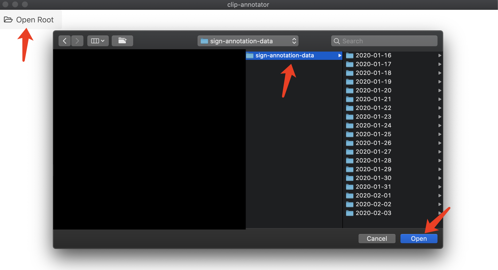
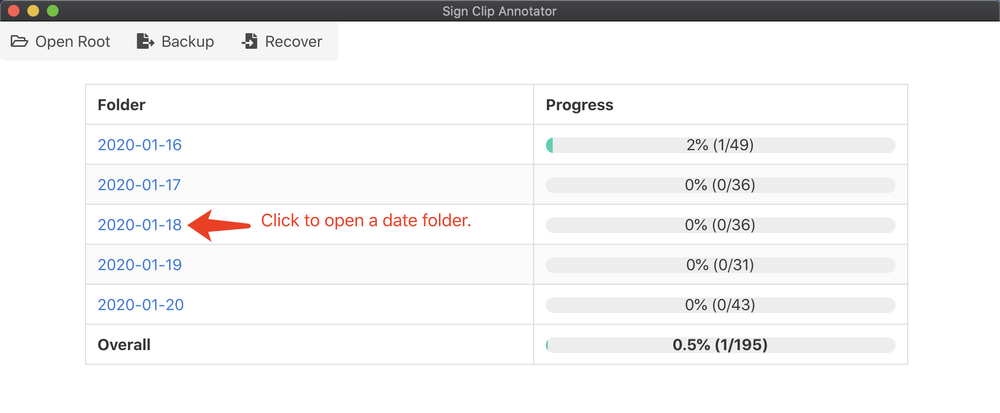
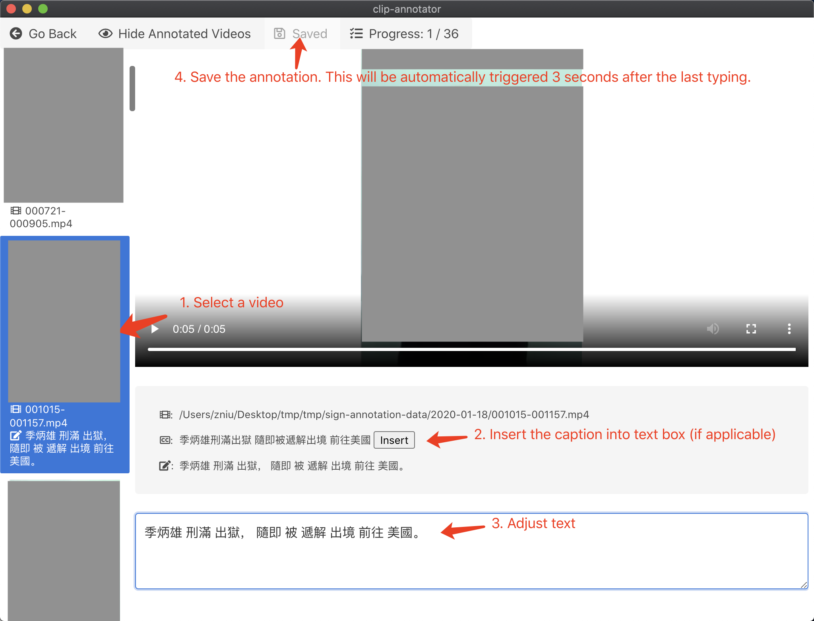
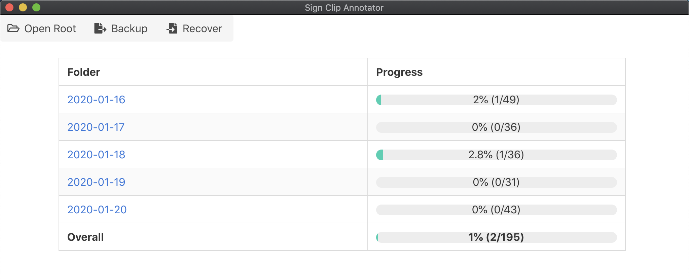
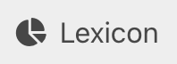
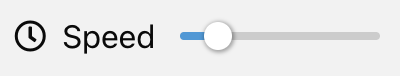

# Sign Clip Annotator

## Quick Start

1. Install [Node.js](https://nodejs.org/en/download/).
2. Run the following command to install the dependencies and start the annotator.

```
npm install
npm run electron:serve
```

3. (Optional) You may also build the annotator into a standalone application by running the following command.

```
npm run electron:build
```

## User Instructions

1. Open the root folder (i.e., the folder containing the episode folders named by dates) from the file system.



2. Click a date to annotate.



3. Annotate a video.
   - Saving
     - In addition to manually clicking the `Save` button, annotations are also automatically saved when: (a) 3 seconds after the last typing, or (b) the `Go Back` button is clicked. After auto-saving, the `Save` button will turn gray.
     - Annotations are saved to annotations.csv locally under each date folder. Please do not modify them manually.
   - Visibility
     - Clicking the `Hide/Show Annotated Videos` button will hide/show the annotated videos in the video list. A video is considered annotated as long as there is some text in its text box. This will help you quickly find unannotated videos.
   - Shortcuts
     - Jump to the next video: `Ctrl` (or `Cmd`) + `Enter`
     - Jump to the previous video: `Shift` + `Enter`



4. After annotation, you may return to the main panel to check the progress by clicking the `Go back` button.
   - Export
     - The `Export` button collects and backs up the annotations. You need to manually specify the path for the `.csv` file during exporting. After annotation, you may send us the exported `.csv` file.
   - Recover
     - The `Recover` button recovers your annotation from a specific backup (the exported `.csv` file). Please don't use Recover unless there are systematic errors (e.g., software crashes), as it will overwrite the existing annotations with the annotations in the `.csv` file.



## Release Notes

### 0.1.1

1. Added the lexicon panel, where users can find statistics about the lexicon. By clicking the `Export` button in the lexicon panel, lexicon data can be exported to a `.csv` file.



2. Added a speed slider to the annotator panel, supporting video speed control from 0.3x to 1.5x.



3. Renamed the `backup` button to `export` for clarity. The exported (e.g., backup) file is now human-readable and can be imported to Excel.
